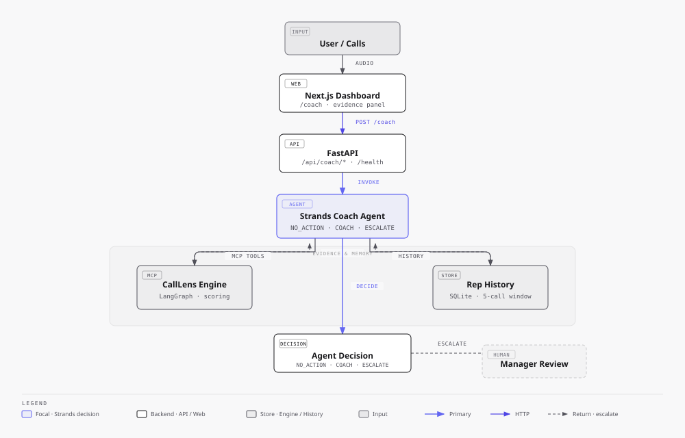
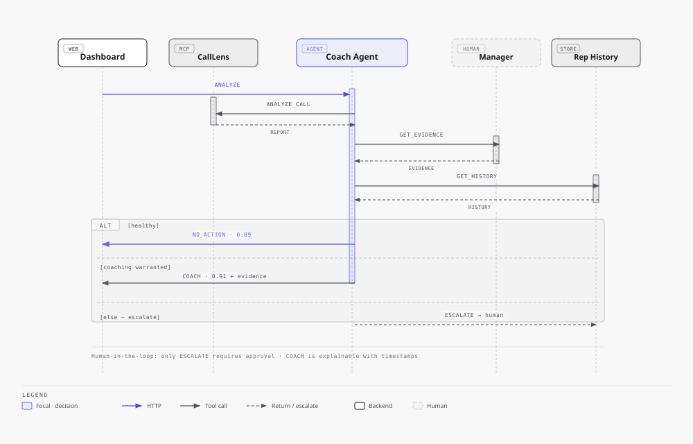
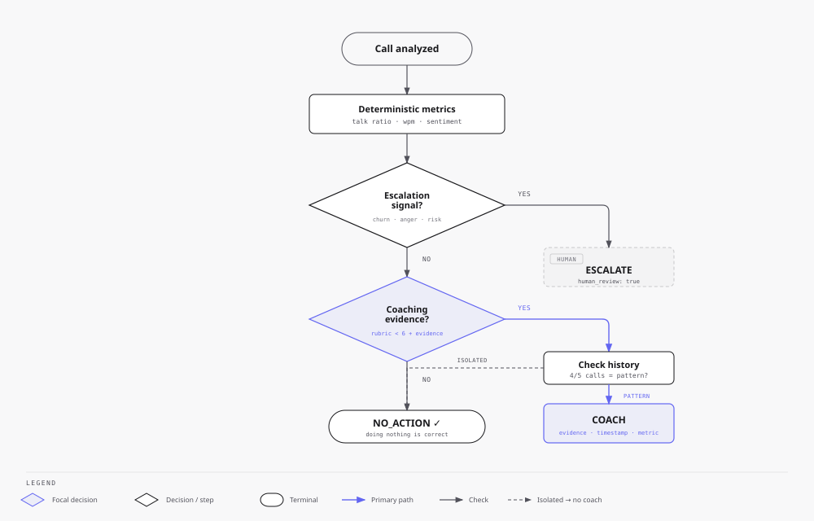
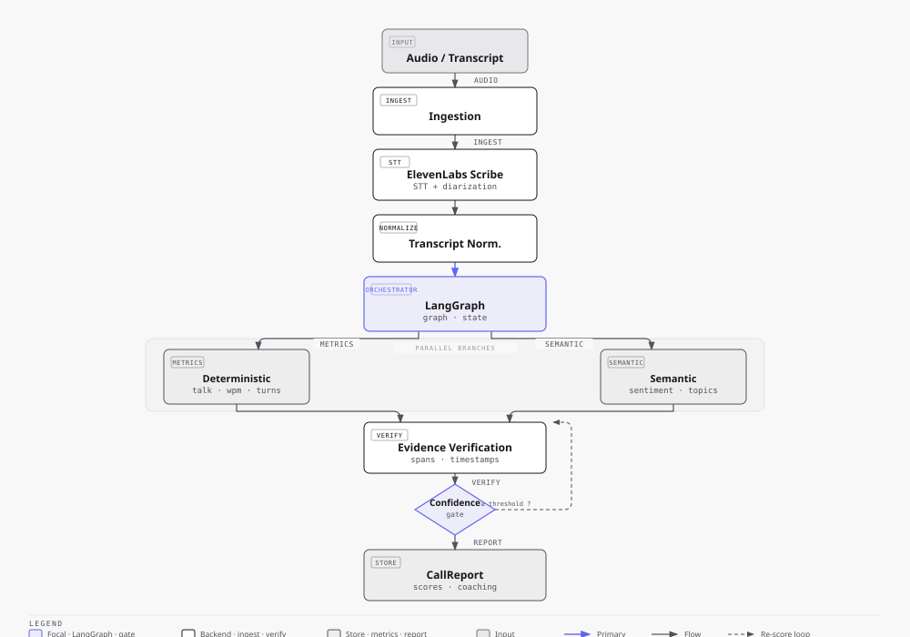

# CallLens

**Open-source conversation intelligence and behavioral evaluation powered by LangGraph — plus CallLens Coach, the autonomous manager that decides what happens next.**

> Upload a call. CallLens transcribes it, reconstructs the conversation, measures deterministic communication metrics, evaluates semantic behaviors against configurable rubrics, verifies the supporting evidence, and produces explainable conversation intelligence.
>
> **CallLens Coach** then asks: *"Given what happened in this conversation, should anything happen next?"* — and autonomously chooses **NO_ACTION · COACH · ESCALATE**, with evidence, not vibes.

CallLens turns raw conversations — recordings or transcripts — into **structured, evidence-backed behavioral intelligence**: diarized transcripts, talk-time and pace metrics, longitudinal sentiment, topics, opportunity/risk detection, and per-representative analytics, all scored against declarative, versioned rubrics.

**Every semantic score is evidence-backed.** Never just `Discovery: 8/10`. Instead:

```
Discovery: 8.7/10
Confidence: 0.91

Evidence:
  04:32  Representative asks customer about their current operational bottleneck.
  05:17  Representative asks about business impact.
  07:02  Customer explains delivery delays.

Missing behavior:
  Representative never established urgency or implementation timeframe.
```

Users click a timestamp and the audio player **jumps to that exact moment**.

---

## The Problem

Managers shouldn't listen to 30 calls to discover the one conversation that needs their attention. Most tools are dashboards that generate *more* analysis to read. They don't answer whether a human should intervene, coach, or do nothing — so attention is wasted and coaching is inconsistent.

## The Solution

**CallLens Coach** is an autonomous manager built as an add-on in this same repository. CallLens remains the specialized conversation-intelligence engine (transcribe → metrics → rubric scoring → evidence verification). **Strands Agents SDK is the decision layer on top**: it receives a call analysis, calls tools when needed, inspects evidence and deterministic metrics, consults lightweight rep history, and produces an explainable **NO_ACTION / COACH / ESCALATE** decision — with the correct behavior often being to stay silent.

> The product is not valuable because it generates more AI output. It is valuable because it **returns human attention only when human attention is useful**.

---

## Demo

Interactive diagrams (full branded HTML) live in [`docs/diagrams/`](docs/diagrams/) — open them directly in a browser:

- [`architecture.html`](docs/diagrams/architecture.html) · [`agent-flow.html`](docs/diagrams/agent-flow.html) · [`decision-flow.html`](docs/diagrams/decision-flow.html) · [`pipeline.html`](docs/diagrams/pipeline.html)

A single-screen Coach dashboard is the design target:

```
CALLLENS COACH

TODAY
18 calls analyzed

15  No action required
 2  Coaching generated
 1  Manager review required

Sarah — Acme Corp        ✓ No action
Daniel — Northstar       ⚠ Coaching generated  · Discovery · Talk balance → View evidence
Maya — Contoso           🔴 Manager review required · Customer churn risk → View evidence
```

For a selected call, an agent activity trace (no hidden chain-of-thought) and an evidence panel with metric, rubric, timestamps, and recommended action are shown. See **Demo Mode** below for the three deterministic scenarios (healthy → NO_ACTION, coaching → COACH, churn → ESCALATE).

---

## How It Works

### CallLens baseline (existing)

Audio or transcript → ElevenLabs Scribe v2 (STT + diarization) → transcript normalization → **LangGraph** orchestration: deterministic metrics (talk ratio, wpm, interruptions, turns, silences) in parallel with semantic analysis (sentiment, topics, intents) and per-dimension rubric scoring (evidence extraction → verification → scoring → consistency → confidence gate → bounded re-judge) → coaching → `CallReport`.

### Coach layer (new, same repo)

```
User / Calls
    ↓
Next.js Dashboard (/coach)
    ↓
FastAPI (/api/coach/*)
    ↓
Strands Coach Agent
    ↓
CallLens MCP / Analysis  +  Rep History (SQLite, 5-call window)
    ↓
Evidence + Metrics + History
    ↓
Decision
 ├── NO_ACTION — healthy, no interruption warranted
 ├── COACH — targeted coaching with evidence + metric + rubric + suggestion
 └── ESCALATE → Human Manager — churn / risk / compliance / ambiguity
```

Deterministic escalation signals are checked first; rubric+evidence is second; historical pattern (e.g. “discovery issue in 4/5 calls”) gates COACH so a single isolated low score does not trigger coaching.

---

## Why This Is an Agent

This is not another analytics dashboard. The agent **makes an autonomous decision** per conversation and triggers the appropriate action — or explicitly does nothing. It:

1. receives/contextualizes a call analysis
2. calls tools when needed (`analyze_call`, `get_call_evidence`, `get_rep_history`, `get_available_rubrics`, `create_coaching_action`, `escalate_to_manager`, `record_agent_decision`)
3. inspects evidence and deterministic metrics (not just LLM vibes)
4. determines whether additional information is required
5. decides NO_ACTION vs COACH vs ESCALATE
6. generates an explainable reason with timestamps
7. triggers the appropriate action/tool
8. knows when human involvement is required

LangGraph is *not* ported to Strands line-for-line. CallLens *is* the evidence layer; Strands *is* the orchestration layer.

---

## Architecture

Branded diagrams are generated with [`cathrynlavery/diagram-design`](https://github.com/cathrynlavery/diagram-design) and skinned to the CallLens brand (`zinc-950 #09090b`, `indigo-500 #6366f1` focal, zinc neutrals — matching `apps/web` `from-indigo-500 to-fuchsia-500`). The style guide lives at `.agents/skills/diagram-design/references/style-guide.md`.

### System overview — Strands is the decision layer, CallLens is the evidence layer



*Interactive: [`docs/diagrams/architecture.html`](docs/diagrams/architecture.html)*

### Agent trace — one call, one autonomous review



*Interactive: [`docs/diagrams/agent-flow.html`](docs/diagrams/agent-flow.html)*

The Strands agent calls `ANALYZE_CALL` → `GET_EVIDENCE` → `GET_HISTORY`, then enters an `ALT` fragment: `NO_ACTION (0.89)`, `COACH (0.91 + evidence)`, or `ESCALATE → human`. Human-in-the-loop only on ESCALATE; COACH is explainable with timestamps.

### Decision logic — should anything happen next?



*Interactive: [`docs/diagrams/decision-flow.html`](docs/diagrams/decision-flow.html)*

Escalation signals (churn, anger, risk) win first. Otherwise rubric + evidence is evaluated, then rep history gates coaching: a repeated pattern (e.g. 4/5) → COACH, an isolated miss → NO_ACTION. Staying silent is a correct outcome.

Existing CallLens pipeline detail — branded with the same CallLens skin (`cathrynlavery/diagram-design`):



*Interactive: [`docs/diagrams/pipeline.html`](docs/diagrams/pipeline.html)*

CallLens pipeline: **Audio or transcript → ElevenLabs Scribe v2 (STT + diarization) → transcript normalization → LangGraph orchestration** (deterministic metrics + semantic analysis in parallel) → **evidence verification → confidence gate → bounded re-score → CallReport**. Every score is timestamp-traceable. See [docs/ARCHITECTURE.md](docs/ARCHITECTURE.md), [docs/LANGGRAPH.md](docs/LANGGRAPH.md), and [docs/DATA_MODEL.md](docs/DATA_MODEL.md). Full diagram sources are `docs/diagrams/*.html` (branded HTML) and `docs/diagrams/*.svg` (portable SVG) — both generated from the same inline SVG.

---

## How Strands Controls the Workflow

CallLens provides the analysis/evidence layer. **Strands Agents SDK owns the autonomous Coach loop**: it invokes CallLens tools, gathers evidence/history, selects NO_ACTION / COACH / ESCALATE, and triggers the corresponding action.

```text
Call arrives
   ↓
Strands Coach Agent
   ↓
Agent calls CallLens tools
 ├── check_escalation_signals (hard guardrail)
 ├── get_call_evidence (timestamped rubric evidence)
 ├── get_rep_history (5-call pattern, e.g. discovery 4/5)
 └── get_available_rubrics / analyze_call
   ↓
Agent determines whether it has enough information
   ↓
Agent chooses: NO_ACTION · COACH · ESCALATE  (structured CoachDecision)
   ↓
validate_agent_decision + check_hard_escalation_rules (guardrails)
   ↓
Agent calls corresponding action tool
 ├── record_agent_decision  (NO_ACTION — silence is correct)
 ├── create_coaching_action (COACH — evidence + metric + rubric)
 └── escalate_to_manager    (ESCALATE — human_review_required=true)
   ↓
CoachDecision returned (explainable, with trace)
```

Example tool traces — the activity shown in `/coach` is the real Strands execution, not a static list:

```text
# Healthy → NO_ACTION (doing nothing is correct)
✓ Strands requested check_escalation_signals  — check_escalation_signals completed
✓ Strands requested get_call_evidence        — get_call_evidence completed
✓ Strands requested get_rep_history          — Previous 5 calls: …
✓ Strands requested record_agent_decision    — record_agent_decision executed
⚑ Decision: No material issue — silence is correct

# Repeated weakness → COACH
✓ Strands requested check_escalation_signals
✓ Strands requested get_call_evidence
✓ Strands requested get_rep_history          — discovery_issue 4/5
✓ Strands requested create_coaching_action   — create_coaching_action executed
⚠ Coaching warranted — repeated evidence

# Churn signal → ESCALATE (human-in-the-loop)
✓ Strands requested check_escalation_signals
✓ Strands requested get_call_evidence
✓ Strands requested get_rep_history
✓ Strands requested escalate_to_manager      — escalate_to_manager executed
🔴 Manager review required
```

Deterministic policy (`decide()`) is kept as `validate_agent_decision` / `check_hard_escalation_rules` / `calculate_policy_signals` and as the offline `CoachDeterministicModel` (so `DEMO_MODE=true` still runs the full Strands loop with no keys). It never makes the primary decision — `Agent(prompt, structured_output_model=CoachDecision).structured_output` does, with validation/retry and a safe fallback only if the loop crashes.

## Strands Agents SDK

Strands Agents SDK is central to the Coach implementation. The Coach agent owns the loop — CallLens never drives the decision. The agent is given a small, typed toolset and must decide when to call tools, when it has enough evidence, and when to stop:

- `analyze_call(transcript, rubric)` — run the full CallLens pipeline
- `get_call_evidence(call_id, dimension)` — retrieve verified evidence with timestamps
- `check_escalation_signals(call_id, transcript_snippet)` — hard escalation guardrail as a tool
- `get_rep_history(rep_id)` — last 5 calls, pattern counts (e.g. discovery miss 4/5)
- `get_available_rubrics()` — list declarative rubrics
- `create_coaching_action(call_id, message, evidence)` — emit a COACH action
- `escalate_to_manager(call_id, reason, evidence, urgency)` — emit ESCALATE
- `record_agent_decision(decision)` — persist the structured result (confidence, summary, evidence, metrics, human_review_required)

Every completed evaluation produces a structured decision:

```json
{
  "decision": "COACH",
  "confidence": 0.91,
  "summary": "The rep did not sufficiently explore the customer's underlying requirements.",
  "evidence": [{ "timestamp": "00:02:14", "quote": "...", "reason": "Pricing concern answered without a discovery question." }],
  "metrics": { "rep_talk_ratio": 0.79 },
  "recommended_action": { "type": "COACH", "message": "Pause after a concern and ask one discovery question before proposing a solution." },
  "human_review_required": false
}
```

`ESCALATE` sets `human_review_required: true`; `NO_ACTION` explains why no interruption was warranted. No hidden chain-of-thought is exposed — only a concise activity trace and user-facing rationale.

Provider abstraction is preserved so Sarvam (live-tested via `SarvamModel` on `sarvam-105b`) and Bedrock can be enabled via configuration (see **Configuration**). Local development defaults to the deterministic mock LLM — no paid calls required; use `mock` for recording, `COACH_MODEL_PROVIDER=sarvam` for live judging if needed.

---

## MCP Integration

CallLens already ships an MCP server (`mcp-server/server.py`, deployable via `mcpize`) exposing:

- `analyze_transcript(transcript, rubric)` — full pipeline over a transcript
- `score_dimension(transcript, dimension, rubric)` — evidence-backed single-dimension score
- `list_rubrics()` — available declarative rubrics and dimensions

The Coach agent consumes CallLens through MCP (or a clean tool adapter that wraps the same calls) — no fake integrations. Strands = autonomous orchestration; CallLens = specialized evidence/intelligence. See [mcpize.yaml](mcpize.yaml).

```bash
mcpize analyze && mcpize doctor && mcpize deploy
# Local stdio:
pip install -r requirements.txt
python mcp-server/server.py
```

---

## Explainability

Every COACH or ESCALATE decision is explainable through:

- transcript evidence with timestamp(s)
- relevant deterministic metric(s) (e.g. rep talk ratio 79%, discovery 42/100)
- relevant rubric criterion
- confidence
- short rationale

Example: *“Discovery 42/100 · Rep talk ratio 79% · Evidence at 02:14 — pricing concern answered without a discovery question. Coaching: pause and ask one discovery question before proposing a solution.”* Vague outputs like “The AI thinks this call was poor” are avoided.

---

## Human-in-the-Loop

The agent demonstrates sensible boundaries. High-impact or ambiguous decisions surface as **Manager review required** with reason, evidence, urgency, and recommended next action. The agent never takes irreversible real-world actions autonomously. For the demo, one escalation scenario makes manager review visibly required.

---

## Tech Stack

`strands-agents-sdk` · `python` · `fastapi` · `nextjs` · `typescript` · `mcp` · `ai-agents` · `agentic-ai` · `conversation-intelligence` · `sales-coaching` · `human-in-the-loop` · `explainable-ai` · `langgraph` · `elevenlabs` · `sqlalchemy` · `docker`

---

## Local Development

### Docker (recommended)

```bash
cp .env.example .env
docker compose up
```

- API + OpenAPI docs: http://localhost:8000/docs
- Dashboard: http://localhost:3000
- Coach: http://localhost:3000/coach

No API keys are required to try it: without `ELEVENLABS_API_KEY` the speech provider and reasoning LLM fall back to deterministic offline mocks, so the full pipeline (transcribe → metrics → evidence-backed rubric scoring → coaching) runs end to end.

### Local (Python)

```bash
python -m venv .venv && source .venv/bin/activate
pip install -e ".[dev]"

# Analyze a transcript (offline, deterministic)
calllens analyze sample.txt

# Start the API server
calllens server

# Run the evaluation harness
calllens eval run
```

### Frontend

```bash
cd apps/web
npm install
NEXT_PUBLIC_API_URL=http://localhost:8000 npm run dev
```

## CLI

```bash
calllens analyze call.mp3
calllens analyze call.mp3 --rubric consultative_sales --output report.json
calllens rubric list
calllens rubric validate ./my_rubric.yaml
calllens eval run
calllens server
```

## Python SDK

```python
import asyncio
from calllens import CallLens


async def main():
    async with CallLens(base_url="http://localhost:8000") as client:
        call = await client.calls.upload("sales-call.mp3")
        await call.analyze(rubric="consultative_sales")
        report = await call.report()
        print(report["overall_score"], report["confidence"])


asyncio.run(main())
```

## REST API (subset)

```
POST   /api/v1/calls                     upload a recording or transcript
GET    /api/v1/calls
GET    /api/v1/calls/{id}
POST   /api/v1/calls/{id}/analyze
GET    /api/v1/calls/{id}/analysis       the evidence-backed CallReport
GET    /api/v1/calls/{id}/transcript
DELETE /api/v1/calls/{id}                privacy/retention deletion
POST   /api/v1/rubrics                   register a declarative rubric
GET    /api/v1/rubrics
POST   /api/v1/rubrics/validate
GET    /api/v1/reps/{id}/analytics
POST   /api/v1/evals/run

# Coach (add-on)
POST   /api/coach/analyze
GET    /api/coach/calls
GET    /api/coach/calls/{id}
GET    /api/coach/reps/{id}/history
GET    /api/coach/summary
```

Interactive docs at `/docs`.

---

## Demo Mode

```env
DEMO_MODE=true
```

In demo mode synthetic calls are seeded and the three scenarios are available instantly with deterministic results — no paid transcription or live third-party dependency. A **Load Demo Calls** action (or auto-seed) makes them navigable without terminal commands.

| Scenario | Expected decision | Signal |
|---|---|---|
| **A — healthy call** | `NO_ACTION` | Balanced talk, good discovery, clear next step, no major concern |
| **B — coaching needed** | `COACH` | Rep dominates, misses discovery, jumps to solution — with evidence |
| **C — escalation** | `ESCALATE` | Serious dissatisfaction / churn signal — manager review required |

### Live Coach with Sarvam (optional, real LLM)

Deterministic `mock` is recommended for recording (stable, offline). For a live `Sarvam → Strands → tools → CoachDecision` demo the same 3 synthetic calls run through the real model — Strands owns the loop, deterministic `decide()` is only guardrail/fallback:

```env
# .env — keep DEMO_MODE=true so the same 3 synthetic calls are used
DEMO_MODE=true
SARVAM_API_KEY=sk_...
SARVAM_MODEL_ID=sarvam-105b
SARVAM_BASE_URL=https://api.sarvam.ai/v1
COACH_MODEL_PROVIDER=sarvam
COACH_MODEL_ID=sarvam-105b
```

```bash
docker compose up --build -d
# or local (no Docker)
# pip install -e ".[dev]"
# DEMO_MODE=true COACH_MODEL_PROVIDER=sarvam uvicorn calllens.api:create_app --factory --host 0.0.0.0 --port 8000
```

Verify the loop is live (tool traces, no fallback):

```bash
curl -s http://localhost:8000/api/coach/summary | jq .
curl -s http://localhost:8000/api/coach/calls | jq '.[0:3] | .[] | {call_id, decision, confidence, model_provider}'
curl -s http://localhost:8000/api/coach/calls/demo-sarah-acme | jq '{decision, confidence, model_provider, human_review_required, evidence, trace}'
```

Expected (live-tested via `packages/calllens/src/calllens/coach/sarvam_model.py` → `SarvamModel(OpenAIModel)` stringifies content for Sarvam's string-only `/v1/chat/completions`):

- `healthy → NO_ACTION` · conf ~0.89 · `record_agent_decision` · `human_review_required=false` · `Strands requested check_escalation_signals / get_call_evidence / get_rep_history`
- `coaching → COACH` · conf ~0.82 · `create_coaching_action` · evidence at `00:00` · `discovery_issue 4/5`
- `escalation → ESCALATE` · conf ~0.94 · `escalate_to_manager` · `human_review_required=true`

Each shows `model_provider: "sarvam"`, a real Strands tool trace (not a static list), and `Fallback used: NO`. See `SARVAM_API_KEY` in [`.env.example`](.env.example) and `packages/calllens/src/calllens/coach/sarvam_model.py`.

---

## Demo Walkthrough (60-second judge path)

No keys, no audio files — everything runs on mocks. Copy, paste, judge.

### 0. Start the stack

```bash
cp .env.example .env
echo "DEMO_MODE=true" >> .env
docker compose up --build -d
# Backend: http://localhost:8000/docs  Frontend: http://localhost:3000
```

Health check (optional):

```bash
curl -s http://localhost:8000/health | jq .
# { "status": "ok", "llm_provider": "mock" }
```

### 1. Open the Coach

```
http://localhost:3000/coach
```

- If not auto-seeded, click **Load Demo Calls** (top-right).
- You should see:

```
CALLLENS COACH — TODAY
18 calls analyzed · 15  No action required · 2  Coaching generated · 1  Manager review required
```

### 2. Three scenarios — 20 seconds each

| # | Call | Expected decision | What to verify |
|---|---|---|---|
| A | **Sarah — Acme Corp** | `NO_ACTION` ✓ | Click the row → `NO_ACTION` badge, confidence ~0.89, short reason like “No material coaching or escalation condition detected.” No evidence panel needed — silence was correct. |
| B | **Daniel — Northstar** | `COACH` ⚠ | Click **View evidence** → discovery score low, rep talk ratio high (e.g. 79%), 2–3 timestamped excerpts with quotes, metric + rubric criterion cited, and a concrete coaching message: “On your next call, pause after the customer raises a concern and ask one discovery question…” |
| C | **Maya — Contoso** | `ESCALATE` 🔴 | Red **Manager review required** banner, reason + urgency + churn/risk evidence with timestamps. `human_review_required: true` is visible. No auto-action beyond flagging. |

### 3. Evidence & agent trace (pick any of B/C)

1. Open Daniel or Maya → **Agent activity** card should show (no chain-of-thought):
   ```
   ✓ CallLens analysis completed
   ✓ 3 relevant transcript moments found
   ✓ Similar issue detected in 3 previous calls
   → Coaching warranted / Manager review required
   ```
2. Scroll to **Evidence** → metric (e.g. `Rep talk ratio 79%`), rubric dimension, 02:14-style timestamps that seek the transcript, confidence (≈0.91), and resulting action.

### 4. API (same data, for curl judges)

```bash
# Summary counts
curl -s http://localhost:8000/api/coach/summary | jq .

# List calls (with decision badges)
curl -s http://localhost:8000/api/coach/calls | jq '.[0:3] | .[] | {id, decision, confidence}'

# Full decision for one call (replace {id} with an id from above)
curl -s http://localhost:8000/api/coach/calls/{id} | jq '.decision, .confidence, .evidence, .human_review_required'

# Rep history gating (why B got coached — pattern 3/5)
curl -s http://localhost:8000/api/coach/reps/{rep_id}/history | jq .
```

All three decisions, evidence, metrics, rubric labels and `human_review_required` are visible via API and in the UI. The interactive branded diagrams are at [`docs/diagrams/architecture.html`](docs/diagrams/architecture.html), [`agent-flow.html`](docs/diagrams/agent-flow.html), [`decision-flow.html`](docs/diagrams/decision-flow.html), [`pipeline.html`](docs/diagrams/pipeline.html).

### 5. What to screenshot

- The one-screen `CALLLENS COACH` summary (today + list).
- Daniel's evidence panel (the richest EXPLAINABLE-AI proof).
- Maya's red escalation banner (the human-in-the-loop proof).

If the stack doesn't come up, `docker compose logs api web` is enough — the stack runs fully on `LLM_PROVIDER=mock`, no ElevenLabs/Bedrock/Sarvam keys required, and the demo seed is deterministic so recording never flakes. For live judging add `COACH_MODEL_PROVIDER=sarvam` as shown in **Live Coach with Sarvam** above.

---

## Configuration

See [`.env.example`](.env.example). Key vars:

| Var | Purpose | Required |
|---|---|---|
| `ELEVENLABS_API_KEY` | Speech provider (Scribe v2) | No — mock fallback |
| `LLM_PROVIDER` | `mock` (default) · `openai` · `anthropic` · `compatible` · `bedrock` · `sarvam` | No |
| `LLM_MODEL` / `MODEL_ID` | Model id for the selected provider | No |
| `OPENAI_API_KEY` / `ANTHROPIC_API_KEY` | Vendor keys | If provider selected |
| `COMPATIBLE_BASE_URL` / `COMPATIBLE_API_KEY` | OpenAI-compatible endpoint | If `compatible` |
| `MODEL_PROVIDER` / `BEDROCK_MODEL_ID` / `AWS_REGION` / `AWS_ACCESS_KEY_ID` / `AWS_SECRET_ACCESS_KEY` | Bedrock (enabled via config, fallback preserved) | No — only if Bedrock is used |
| `SARVAM_API_KEY` / `SARVAM_MODEL_ID` / `SARVAM_BASE_URL` | Sarvam AI (string-only OpenAI-compatible, via `SarvamModel`) | No — only if Sarvam is used |
| `COACH_MODEL_PROVIDER` / `COACH_MODEL_ID` | Coach override (`sarvam` live-tested as `sarvam-105b` @ `https://api.sarvam.ai/v1`; `mock` for deterministic recording) | No — defaults to `LLM_PROVIDER` |
| `DATABASE_URL` | `postgresql+asyncpg://…` or `sqlite+aiosqlite://…` | No — defaults to SQLite |
| `CONFIDENCE_THRESHOLD` / `MAX_RESCORE_ATTEMPTS` | Pipeline knobs | No |
| `DEMO_MODE` | Seed synthetic demo calls | No |
| `NEXT_PUBLIC_API_URL` | Frontend API base | No — defaults to `http://localhost:8000` |

Sarvam is live-tested (`sarvam-105b` via `SarvamModel` + `COACH_MODEL_PROVIDER=sarvam`) and deterministic mock remains the default for recording. Bedrock is designed as a configuration switch (model-provider abstraction), not a migration. The app runs on Azure VM by default; Bedrock is only claimed when actually implemented and tested.

---

## Rubrics

Rubrics are **declarative and versioned** YAML documents. The engine itself is generic — sales is just the first bundled rubric. Bring your own: customer support, recruitment, collections, insurance, real estate, customer success, interviews, AI voice agents.

```yaml
name: consultative_sales
version: "1.0"
dimensions:
  rapport:
    label: Rapport
    weight: 0.08
  discovery:
    label: Problem Discovery
    weight: 0.16
```

Dimension weights must sum to `1.0`. See [rubrics/](rubrics/) and [docs/custom-rubrics](docs/CUSTOM_RUBRICS.md).

## Providers

| Layer | Provider | Config |
| --- | --- | --- |
| Speech (STT/TTS) | ElevenLabs Scribe v2 | `ELEVENLABS_API_KEY`, `ELEVENLABS_STT_MODEL` |
| Reasoning LLM | OpenAI | `LLM_PROVIDER=openai`, `OPENAI_API_KEY`, `LLM_MODEL` |
| Reasoning LLM | Anthropic | `LLM_PROVIDER=anthropic`, `ANTHROPIC_API_KEY`, `LLM_MODEL` |
| Reasoning LLM | Any OpenAI-compatible endpoint | `LLM_PROVIDER=compatible`, `COMPATIBLE_BASE_URL`, `COMPATIBLE_API_KEY` |
| Reasoning LLM | Amazon Bedrock | `MODEL_PROVIDER=bedrock`, `AWS_REGION`, `BEDROCK_MODEL_ID` |
| Reasoning LLM | Sarvam AI (string-only, live-tested) | `COACH_MODEL_PROVIDER=sarvam`, `SARVAM_API_KEY`, `SARVAM_MODEL_ID=sarvam-105b` @ `https://api.sarvam.ai/v1` (via `SarvamModel`) |
| Reasoning LLM | Offline mock (default) | `LLM_PROVIDER=mock` |

All tests and CI run against mocks — no paid API calls.

### Example: live analysis with real providers

Wire both providers in `.env` and analyze an actual recording:

```bash
# .env — speech + reasoning
ELEVENLABS_API_KEY=sk_...
ELEVENLABS_STT_MODEL=scribe_v2

# Any OpenAI-compatible endpoint, e.g. Melious (https://api.melious.ai/v1)
LLM_PROVIDER=compatible
COMPATIBLE_BASE_URL=https://api.melious.ai/v1
COMPATIBLE_API_KEY=sk-mel-...
LLM_MODEL=gpt-oss-120b
```

Then run the full pipeline on a recording — it must be a pre-recorded call file
(MP3/WAV), but you can synthesize one if you don't have a recording handy:

```bash
# Option A — you have a recording: transcribe + analyze it live
# (Scribe v2 STT → metrics → evidence-backed scoring → coaching)
calllens analyze call.mp3 --rubric consultative_sales --output report.json

# Option B — no recording? Synthesize a two-speaker sample call with ElevenLabs TTS
python examples/generate_sample_call.py   # → sample_call.mp3
calllens analyze sample_call.mp3 --rubric consultative_sales --output report.json

# Both write the evidence-backed report (scores + timestamped evidence + coaching)
# to report.json; omit --output to print it to stdout.
```

> The `compatible` endpoint must support OpenAI JSON-schema structured outputs
> (`response_format: {type: "json_schema"}`) — the pipeline's `structured_completion`
> depends on it. Not every model on every gateway does; e.g. `gpt-oss-120b` on
> Melious works, while several others (GLM, Kimi, DeepSeek v4 on Melious) reject
> schema mode. Probe with a small structured call before committing to a model.

## Evaluation

```text
| Dimension | MAE | Correlation |
|-----------|-----|-------------|
| Discovery | .61 | .88         |
| Rapport   | .74 | .81         |
```

The harness ([`calllens.evals`](packages/calllens/src/calllens/evals/)) runs the full pipeline over a 13-scenario synthetic dataset (excellent seller, poor seller, weak discovery, angry customer, multilingual, …) and reports MAE, RMSE, correlation, and evidence precision/recall against human-quality labels.

---

## Testing

```bash
pip install -e ".[dev]"
pytest -q
```

Tests cover healthy → NO_ACTION, coaching → COACH, escalation → ESCALATE, decision-schema validation, evidence presence for COACH/ESCALATE, `human_review_required` for escalations, and API smoke tests. Model calls are mocked — CI never depends on live LLM APIs.

---

## Deployment

Target is the existing Linux Azure VM. Application hosting may remain Azure; Bedrock/AgentCore are not required for the first working version.

- `.env.example` documents all vars
- Docker: `Dockerfile.backend` + `Dockerfile.frontend` + `docker-compose.yml`
- Health endpoint: `GET /health` → `{ status: "ok", llm_provider }`
- Production start:

```bash
cp .env.example .env  # then set real values — never commit secrets
docker compose up --build -d
# or
uvicorn calllens.api:create_app --factory --host 0.0.0.0 --port 8000
cd apps/web && npm run build && npm start
```

See `infra/` for AWS sketches (ECS/RDS/S3/SQS) — not required for the local/Azure path.

---

## Pre-existing Work & Hackathon Contributions

**CallLens is pre-existing.** It is an existing Yabloko Labs conversation-intelligence project that already provides transcript ingestion, ElevenLabs transcription/diarization, deterministic metrics, LangGraph-orchestrated semantic analysis, multi-stage evidence-backed rubric scoring with verification and confidence gating, rubrics, MCP server/tools, provider/model abstraction (OpenAI/Anthropic/compatible/mock + ElevenLabs), persistence (memory + SQLAlchemy), REST API, Python SDK/CLI, evaluation harness, and Next.js dashboard. That functionality is reused as the **conversation-analysis capability/tool layer** — not rewritten.

**CallLens Coach is the new hackathon work.** It is the autonomous decision-making layer built in this same repository as an add-on (see **Architecture**):

- Strands Agents SDK as the central orchestration loop (tool calling, `check_escalation_signals` / evidence / history, structured `CoachDecision` via `structured_output_model`, validation + hard-escalation guardrails, NO_ACTION/COACH/ESCALATE + action tool). `decide()` is only a fallback/validator, not the engine — `/coach` shows `Decision engine: Strands Agents SDK` and `Agent tools used:` per call.
- Coach action tools (`analyze_call`, `get_call_evidence`, `check_escalation_signals`, `get_rep_history`, `get_available_rubrics`, `create_coaching_action`, `escalate_to_manager`, `record_agent_decision`) and clean MCP adaptation of existing CallLens tools
- Longitudinal rep history / context (lightweight SQLite, 5-call window) so repeated patterns can be distinguished from isolated misses
- Demo workflow with three synthetic scenarios and a one-screen Coach dashboard (`/coach`) showing summary, call list, agent activity trace, and evidence panel — designed so “doing nothing” is visible as correct behavior
- Branded architecture diagrams (`docs/diagrams/*.html` + `*.svg`) generated with `cathrynlavery/diagram-design` and skinned to the CallLens brand

If code is copied or adapted from CallLens, it is documented. Integration/reuse is preferred over duplicating large amounts of existing source. For Devpost, if a distinct `calllens-coach` repository name is required, this same repository can be pushed to a new remote — history is preserved and originality remains clear via this section and `git log`.

---

## Security & privacy

- API keys are environment-only; nothing is ever committed, logged, or exposed to the browser.
- Call recordings are treated as sensitive: tenant isolation, private/signed storage, deletion and configurable retention.
- Complete transcripts are never logged by default.
- See [SECURITY.md](SECURITY.md) and [docs/ARCHITECTURE.md](docs/ARCHITECTURE.md).

## License

[MIT](LICENSE) © Yabloko Labs
