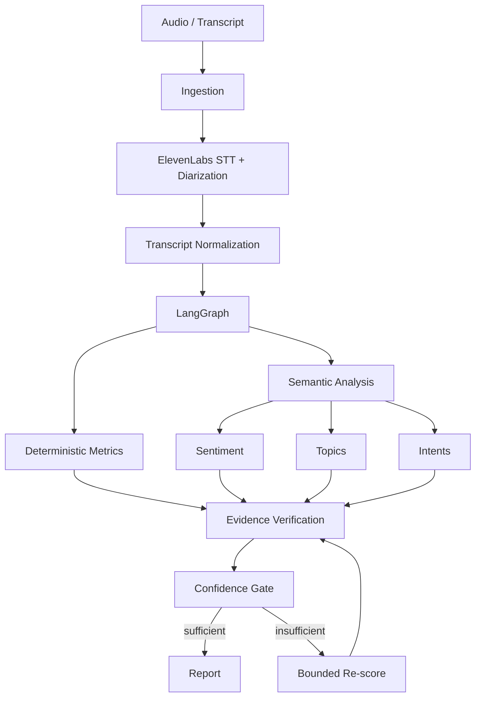

# CallLens

**Open-source conversation intelligence and behavioral evaluation powered by LangGraph.**

> Upload a call. CallLens transcribes it, reconstructs the conversation, measures deterministic communication metrics, evaluates semantic behaviors against configurable rubrics, verifies the supporting evidence, and produces explainable conversation intelligence.

CallLens turns raw conversations — recordings or transcripts — into **structured, evidence-backed behavioral intelligence**: diarized transcripts, talk-time and pace metrics, longitudinal sentiment, topics, opportunity/risk detection, and per-representative analytics, all scored against declarative, versioned rubrics.

**Every semantic score is evidence-backed.** Never just `Discovery: 8/10`. Instead:

```
Discovery: 8.7/10
Confidence: 0.91

Evidence:
  04:32  Representative asks customer about their current operational bottleneck.
  05:17  Representative asks about business impact.
  07:02  Customer explains delivery delays.

Missing behavior:
  Representative never established urgency or implementation timeframe.
```

Users click a timestamp and the audio player **jumps to that exact moment**.

---

## Why it exists

Most call-scoring tools either (a) send the whole transcript to an LLM and ask for a number, or (b) count keywords. CallLens does neither:

- **Multi-stage scoring** — candidate evidence extraction → deterministic verification → rubric scoring → consistency check → confidence gate → bounded re-judge. Never a single "score this transcript" prompt.
- **Deterministic where possible, semantic only where needed** — talk time, wpm, interruptions, turns, and silences are pure Python. LLMs are used for reasoning: sentiment, topics, intent, behavior, coaching.
- **Provider isolation** — a speech abstraction (ElevenLabs today) and an LLM abstraction (OpenAI / Anthropic / any OpenAI-compatible endpoint), so nothing is hardwired to one vendor.
- **Auditable by design** — every analysis records model, prompt, rubric, and pipeline versions.

## Architecture



See [docs/ARCHITECTURE.md](docs/ARCHITECTURE.md), [docs/LANGGRAPH.md](docs/LANGGRAPH.md), and [docs/DATA_MODEL.md](docs/DATA_MODEL.md).

## Quick start

### Docker (recommended)

```bash
cp .env.example .env
docker compose up
```

- API + OpenAPI docs: http://localhost:8000/docs
- Dashboard: http://localhost:3000

No API keys are required to try it: without `ELEVENLABS_API_KEY` the speech provider and reasoning LLM fall back to deterministic offline mocks, so the full pipeline (transcribe → metrics → evidence-backed rubric scoring → coaching) runs end to end.

### Local (Python)

```bash
python -m venv .venv && source .venv/bin/activate
pip install -e ".[dev]"

# Analyze a transcript (offline, deterministic)
calllens analyze sample.txt

# Start the API server
calllens server

# Run the evaluation harness
calllens eval run
```

### Frontend

```bash
cd apps/web
npm install
NEXT_PUBLIC_API_URL=http://localhost:8000 npm run dev
```

## CLI

```bash
calllens analyze call.mp3
calllens analyze call.mp3 --rubric consultative_sales --output report.json
calllens rubric list
calllens rubric validate ./my_rubric.yaml
calllens eval run
calllens server
```

## Python SDK

```python
import asyncio
from calllens import CallLens


async def main():
    async with CallLens(base_url="http://localhost:8000") as client:
        call = await client.calls.upload("sales-call.mp3")
        await call.analyze(rubric="consultative_sales")
        report = await call.report()
        print(report["overall_score"], report["confidence"])


asyncio.run(main())
```

## REST API (subset)

```
POST   /api/v1/calls                     upload a recording or transcript
GET    /api/v1/calls
GET    /api/v1/calls/{id}
POST   /api/v1/calls/{id}/analyze
GET    /api/v1/calls/{id}/analysis       the evidence-backed CallReport
GET    /api/v1/calls/{id}/transcript
DELETE /api/v1/calls/{id}                privacy/retention deletion
POST   /api/v1/rubrics                   register a declarative rubric
GET    /api/v1/rubrics
POST   /api/v1/rubrics/validate
GET    /api/v1/reps/{id}/analytics
POST   /api/v1/evals/run
```

Interactive docs at `/docs`.

## Rubrics

Rubrics are **declarative and versioned** YAML documents. The engine itself is generic — sales is just the first bundled rubric. Bring your own: customer support, recruitment, collections, insurance, real estate, customer success, interviews, AI voice agents.

```yaml
name: consultative_sales
version: "1.0"
dimensions:
  rapport:
    label: Rapport
    weight: 0.08
  discovery:
    label: Problem Discovery
    weight: 0.16
```

Dimension weights must sum to `1.0`. See [rubrics/](rubrics/) and [docs/custom-rubrics](docs/CUSTOM_RUBRICS.md).

## Providers

| Layer | Provider | Config |
| --- | --- | --- |
| Speech (STT/TTS) | ElevenLabs Scribe v2 | `ELEVENLABS_API_KEY`, `ELEVENLABS_STT_MODEL` |
| Reasoning LLM | OpenAI | `LLM_PROVIDER=openai`, `OPENAI_API_KEY`, `LLM_MODEL` |
| Reasoning LLM | Anthropic | `LLM_PROVIDER=anthropic`, `ANTHROPIC_API_KEY`, `LLM_MODEL` |
| Reasoning LLM | Any OpenAI-compatible endpoint | `LLM_PROVIDER=compatible`, `COMPATIBLE_BASE_URL`, `COMPATIBLE_API_KEY` |
| Reasoning LLM | Offline mock (default) | `LLM_PROVIDER=mock` |

All tests and CI run against mocks — no paid API calls.

### Example: live analysis with real providers

Wire both providers in `.env` and analyze an actual recording:

```bash
# .env — speech + reasoning
ELEVENLABS_API_KEY=sk_...
ELEVENLABS_STT_MODEL=scribe_v2

# Any OpenAI-compatible endpoint, e.g. Melious (https://api.melious.ai/v1)
LLM_PROVIDER=compatible
COMPATIBLE_BASE_URL=https://api.melious.ai/v1
COMPATIBLE_API_KEY=sk-mel-...
LLM_MODEL=gpt-oss-120b
```

Then run the full pipeline on a recording — it must be a pre-recorded call file
(MP3/WAV), but you can synthesize one if you don't have a recording handy:

```bash
# Option A — you have a recording: transcribe + analyze it live
# (Scribe v2 STT → metrics → evidence-backed scoring → coaching)
calllens analyze call.mp3 --rubric consultative_sales --output report.json

# Option B — no recording? Synthesize a two-speaker sample call with ElevenLabs TTS
python examples/generate_sample_call.py   # → sample_call.mp3
calllens analyze sample_call.mp3 --rubric consultative_sales --output report.json

# Both write the evidence-backed report (scores + timestamped evidence + coaching)
# to report.json; omit --output to print it to stdout.
```

> The `compatible` endpoint must support OpenAI JSON-schema structured outputs
> (`response_format: {type: "json_schema"}`) — the pipeline's `structured_completion`
> depends on it. Not every model on every gateway does; e.g. `gpt-oss-120b` on
> Melious works, while several others (GLM, Kimi, DeepSeek v4 on Melious) reject
> schema mode. Probe with a small structured call before committing to a model.

## MCP / MCPize

CallLens ships an MCP server exposing `analyze_transcript`, `score_dimension`, and `list_rubrics`, deployable on MCPize:

```bash
mcpize analyze && mcpize doctor && mcpize deploy
```

Local stdio:

```bash
pip install -r requirements.txt
python mcp-server/server.py
```

## Evaluation

```text
| Dimension | MAE | Correlation |
|-----------|-----|-------------|
| Discovery | .61 | .88         |
| Rapport   | .74 | .81         |
```

The harness ([`calllens.evals`](packages/calllens/src/calllens/evals/)) runs the full pipeline over a 13-scenario synthetic dataset (excellent seller, poor seller, weak discovery, angry customer, multilingual, …) and reports MAE, RMSE, correlation, and evidence precision/recall against human-quality labels.

## Roadmap

See [docs/ROADMAP.md](docs/ROADMAP.md). Highlights: Supabase auth/RLS and object storage, async job backends (Redis/SQS), GraphQL dashboard queries, live-call mode, AI role-play mode, per-representative trends, drift monitoring.

## Security & privacy

- API keys are environment-only; nothing is ever committed, logged, or exposed to the browser.
- Call recordings are treated as sensitive: tenant isolation, private/signed storage, deletion and configurable retention.
- Complete transcripts are never logged by default.
- See [SECURITY.md](SECURITY.md) and [docs/ARCHITECTURE.md](docs/ARCHITECTURE.md).

## License

[MIT](LICENSE) © Yabloko Labs
