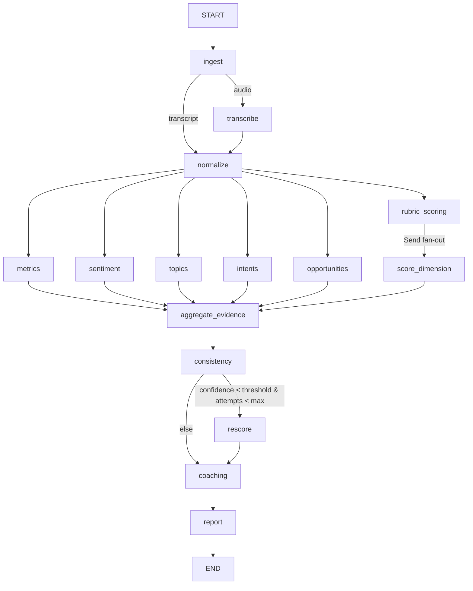

# The LangGraph Pipeline

The analysis graph lives in `packages/calllens/src/calllens/graphs/` (`state.py`, `pipeline.py`).

## State

`ConversationState` is a strongly typed `TypedDict` (no loose dicts):

```python
class ConversationState(TypedDict, total=False):
    call_id: str
    transcript: Transcript | None
    rubric: Rubric | None
    deterministic_metrics: CallMetrics | None
    sentiment: SentimentAnalysis | None
    topics: list[Topic] | None
    intents: list[Intent] | None
    rubric_results: Annotated[list[RubricResult], operator.add]  # reducer
    rubric_scores: list[RubricScore] | None
    opportunities: list[Opportunity] | None
    risks: list[Risk] | None
    evidence: list[Evidence] | None
    coaching: list[CoachingInsight] | None
    confidence: float | None
    validation_errors: Annotated[list[str], operator.add]
    rescore_attempts: int
    status: AnalysisStatus
    model_identity: ModelIdentity | None
    final_report: CallReport | None
```

## Graph



## Key mechanisms

### Parallel execution

Independent work runs concurrently: `metrics`, `sentiment`, `topics`, `intents`, `opportunities`, and per-dimension rubric scoring all fan out from `normalize`. The join point is `aggregate_evidence`.

### Per-dimension fan-out (`Send`)

Rubric dimensions are scored concurrently via LangGraph `Send`:

```python
return Command(
    goto=[Send("score_dimension", {"dim": d, "transcript": t, "attempt": n}) for d in dimensions]
)
```

Each `score_dimension` task runs the full multi-stage pipeline (`RubricScoringPipeline._score_dimension`) for one dimension.

### Confidence gate + bounded re-scoring

`consistency` computes the weighted confidence across dimensions. The conditional edge routes:

- confidence ≥ `CONFIDENCE_THRESHOLD` → `coaching`
- confidence < threshold and attempts < `MAX_RESCORE_ATTEMPTS` → `rescore`

`rescore` re-runs the scoring pipeline inline with a strictly bounded loop (no graph re-entry), so the number of evaluation attempts is guaranteed finite. `RubricResult.rescore_attempts` records the attempt for auditability; `_latest_attempt_results` keeps only the newest attempt's results.

### Checkpoints

The graph compiles with an `InMemorySaver` when `LANGGRAPH_CHECKPOINT=true`, enabling interruption/resume and future human-in-the-loop workflows. Each run uses `thread_id = call_id`.

### Retries

LLM provider calls go through LangChain chat models with `max_retries`; provider failures are surfaced as typed errors and persisted on the analysis run (`FAILED` state), never swallowed.

## Extending the graph

To add a pipeline stage:

1. Add state fields to `ConversationState` (with a reducer if parallel writes).
2. Implement a node method on `AnalysisGraph`.
3. Wire edges in `_build()`.
4. Add a graph test in `tests/graphs/`.
