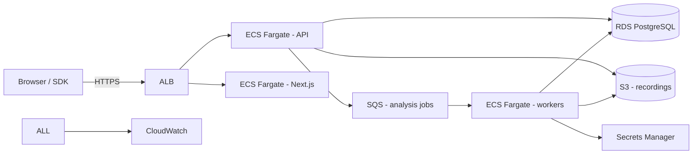

# AWS Production Architecture (reference)

Local development never requires AWS — `docker compose up` is the whole local
environment. When you're ready to run CallLens in production on AWS, this is
the reference topology. The OSS repo works with Supabase (managed Postgres +
storage + auth) or the fully self-managed AWS path below.

## Components

| Component | AWS service | Notes |
| --- | --- | --- |
| API + workers | ECS/Fargate | two task definitions: `api` (FastAPI) and `worker` (job consumer) |
| Database | RDS PostgreSQL | replaces Supabase Postgres; `DATABASE_URL` points here |
| Object storage | S3 | private bucket for recordings; presigned URLs for playback |
| Jobs | SQS | implements the `JobQueue` protocol (see `calllens/api/jobs.py`) |
| Secrets | Secrets Manager | `ELEVENLABS_API_KEY`, `OPENAI_API_KEY`, DB creds |
| Observability | CloudWatch | logs + metrics; never log complete transcripts or secrets |
| Edge | ALB + WAF | TLS termination, rate limiting, upload size limits |

## Swapping the job queue

The API submits analysis jobs through the `JobQueue` protocol. Production
workers consume jobs from SQS and run the same `AnalysisService.analyze`
path as the local in-process queue, so the swap is contained to one adapter.

## Storage security

- Recordings bucket: **private**, server-side encryption, lifecycle rules for
  the retention policy (e.g. 30 days).
- Playback uses presigned GET URLs scoped to the caller's tenant.
- Deleting a call (`DELETE /api/v1/calls/{id}`) also deletes the object.

## Migrations

SQLAlchemy metadata is created on startup (`SQLRepository.create_all`) for
the MVP. Before production, move to versioned Alembic migrations and enable
RLS-style tenant checks at the application layer (or adopt Supabase RLS).
